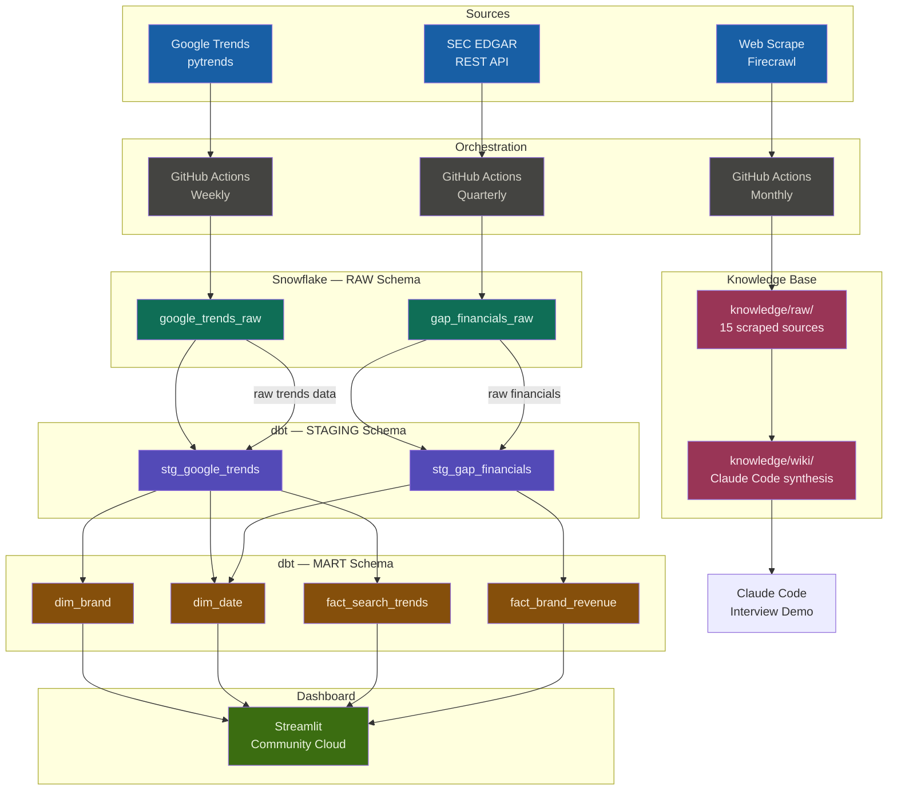

# Gap Inc. Media Analytics Dashboard

An end-to-end analytics pipeline that tracks brand search interest and quarterly revenue for Gap Inc.'s brand portfolio — benchmarked against key competitors — targeting the **Analyst, Media Analytics** role at Gap Inc.

## Project Overview

This project answers two core business questions:
1. **How does search interest for Gap Inc. brands (Old Navy, Gap, Banana Republic, Athleta) compare to competitors over time?**
2. **Does quarterly revenue performance correlate with brand search interest?**

The pipeline ingests weekly Google Trends data and quarterly SEC EDGAR filings, transforms them through a star schema in Snowflake via dbt, and surfaces insights through an interactive Streamlit dashboard.

## Live Dashboard

[Gap Inc. Brand Analytics — Streamlit Community Cloud](https://analyst-media-analyst-nquek.streamlit.app/)

## Tech Stack

| Layer | Tool |
|---|---|
| Data Warehouse | Snowflake |
| Transformation | dbt 1.8 |
| Orchestration | GitHub Actions |
| Dashboard | Streamlit (deployed to Streamlit Community Cloud) |
| Knowledge Base | Claude Code |

## Data Sources

| Source | Type | Schedule |
|---|---|---|
| Google Trends (pytrends) | Python API client | Weekly (Monday) |
| SEC EDGAR REST API | REST API | Quarterly (Feb/May/Aug/Nov) |
| Web scrape (Firecrawl) | Scraper | Monthly |

## Pipeline Diagram



## ERD — Star Schema

```
┌─────────────────────────────┐
│         dim_brand           │
├─────────────────────────────┤
│ brand_id     INT  PK        │
│ brand_term   VARCHAR        │
│ brand_name   VARCHAR        │
│ brand_type   VARCHAR        │ ◄── 'gap_brand' | 'competitor'
│ parent_company VARCHAR      │
└──────────────┬──────────────┘
               │
               │ brand_key
               ▼
┌──────────────────────────────────────┐     ┌───────────────────────────────┐
│        fact_search_trends            │     │        dim_date               │
├──────────────────────────────────────┤     ├───────────────────────────────┤
│ date_key       DATE  FK ─────────────┼────►│ date_day      DATE  PK        │
│ brand_key      INT   FK              │     │ year          INT             │
│ geo            VARCHAR               │     │ month         INT             │
│ interest_score INT                   │     │ quarter       INT             │
└──────────────────────────────────────┘     │ week_of_year  INT             │
                                             │ is_holiday_season BOOLEAN     │
┌──────────────────────────────────────┐     │ retail_event_label VARCHAR    │
│        fact_brand_revenue            │     └───────────────────────────────┘
├──────────────────────────────────────┤
│ date_key       DATE  FK ─────────────┼────► dim_date
│ brand_key      INT   FK              │
│ net_sales_usd  FLOAT                 │
│ yoy_growth_pct FLOAT                 │
│ fiscal_year    INT                   │
│ fiscal_quarter INT                   │
└──────────────────────────────────────┘
```

## Setup

### Prerequisites

- Python 3.11+
- Snowflake account (trial: AWS US East 1)
- dbt-snowflake installed

### Installation

```bash
git clone https://github.com/nquek/analyst-media-analyst
cd analyst-media-analyst
pip install -r requirements.txt
```

### Environment Variables

Create a `.env` file (never commit this):

```
SNOWFLAKE_ACCOUNT=your-account
SNOWFLAKE_USER=your-user
SNOWFLAKE_PASSWORD=your-password
SNOWFLAKE_DATABASE=GAP_ANALYTICS
SNOWFLAKE_WAREHOUSE=COMPUTE_WH
SNOWFLAKE_ROLE=ACCOUNTADMIN
```

### Running the Pipeline Locally

```bash
# Ingest Google Trends (all brands)
python -m ingestion.trends_to_snowflake

# Ingest SEC EDGAR revenue data
python -m ingestion.edgar_to_snowflake

# Transform with dbt
cd dbt
dbt deps
dbt run
dbt test
```

### Running the Dashboard Locally

```bash
# Add .streamlit/secrets.toml with Snowflake credentials first
streamlit run dashboard/app.py
```

## Dashboard Features

| Tab | Analytics Type | Question Answered |
|---|---|---|
| Brand Comparison | Descriptive | How does search interest vary across Gap brands and competitors over 5 years? |
| Seasonality & Retail Moments | Descriptive | When do search interest spikes occur, and what retail events drive them? |
| Revenue vs. Search | Diagnostic | Does quarterly revenue correlate with brand search interest? |

## Key Insights

- **Old Navy** is the search interest volume leader among Gap Inc. brands, with consistent holiday-season spikes (Nov–Dec)
- **Gap brand** shows the strongest YoY revenue recovery in FY2024 (+4% comps), consistent with CEO Dickson's brand reinvigoration playbook
- **Banana Republic** has the weakest search interest among Gap brands, aligning with its -9.6% foot traffic decline (Placer.ai 2024)
- **H&M and Zara** show higher raw search interest than most Gap Inc. brands, reflecting their global scale
- FY2024 gross margin of 41.3% is the highest in approximately 20 years, indicating improved operational discipline alongside the marketing investment

## Knowledge Base

The `knowledge/` directory contains synthesized research on Gap Inc.'s brand portfolio, competitive landscape, and media strategy.

```
knowledge/
  raw/          # 15 scraped sources (earnings releases, trade press, Wikipedia, Placer.ai, Sheng Lu)
  wiki/         # Claude Code-generated synthesis pages
    overview.md               # Company overview and FY2024 results
    brands-and-competitors.md # Per-brand analysis + competitor context
    media-and-marketing-themes.md  # Marketing strategy and campaign analysis
  index.md      # Index of all wiki pages and raw sources
```

Query the knowledge base by asking Claude Code questions like:
- "What does my knowledge base say about Athleta's brand positioning?"
- "What marketing campaigns are mentioned across the raw sources?"
- "How has Old Navy's performance trended through FY2024?"

## Repository Structure

```
analyst-media-analyst/
├── .github/workflows/       # GitHub Actions pipelines
├── dashboard/               # Streamlit app
├── dbt/                     # dbt project (staging + mart models)
│   ├── macros/
│   ├── models/
│   │   ├── staging/
│   │   └── marts/
│   └── seeds/               # dim_brand seed CSV
├── docs/                    # Project documentation
├── ingestion/               # Python ingestion scripts
├── knowledge/               # Knowledge base
│   ├── raw/                 # Scraped source documents
│   └── wiki/                # Synthesized wiki pages
└── tests/                   # Unit tests
```

## Tests

```bash
pytest tests/ -v
```

All 4 unit tests pass (ingestion logic, data shape validation, partial-week filtering).
