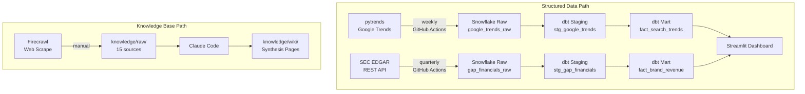
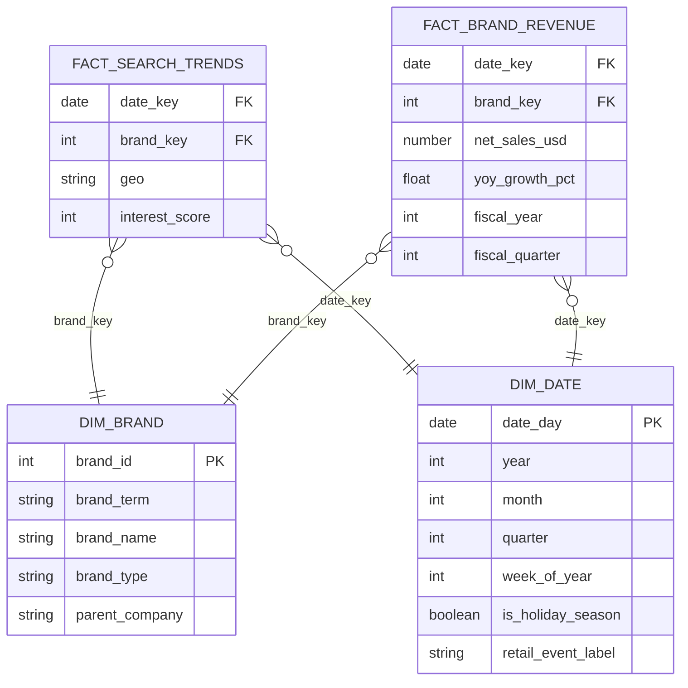

# Milestone 2 Implementation Plan

> **For agentic workers:** REQUIRED SUB-SKILL: Use superpowers:subagent-driven-development (recommended) or superpowers:executing-plans to implement this plan task-by-task. Steps use checkbox (`- [ ]`) syntax for tracking.

**Goal:** Build the complete Milestone 2 pipeline — pytrends ingestion → Snowflake raw → dbt star schema → Streamlit dashboard → GitHub Actions automation → knowledge wiki pages → README with ERD and pipeline diagram.

**Architecture:** pytrends fetches 5 years of weekly US search interest for 8 brands individually (avoiding cross-brand normalization issues) and loads to `raw.google_trends_raw`. dbt transforms both raw tables through staging views into a star schema (2 dims + 2 facts + 1 seed-based dim) materialized as tables in the existing `MART` schema. Streamlit reads from mart tables and renders 3 analytical tabs. GitHub Actions schedules both ingestion scripts. `STAGING` and `MART` schemas already exist in Snowflake; no manual schema creation needed.

**Tech Stack:** Python 3.11, pytrends, snowflake-connector-python, dbt-snowflake 1.8, streamlit, pandas, GitHub Actions

**Snowflake facts confirmed before starting:**
- Database: `GAP_ANALYTICS`
- Schemas: `RAW`, `STAGING`, `MART` all exist
- `raw.gap_financials_raw` has 298 rows (EDGAR loaded)
- `raw.google_trends_raw` does not exist yet (created in Task 3)

---

### Task 1: Update dependencies and gitignore

**Files:**
- Modify: `requirements.txt`
- Modify: `.gitignore`

- [ ] **Step 1: Replace requirements.txt**

```
requests==2.32.3
snowflake-connector-python==3.12.3
firecrawl-py==1.9.0
python-dotenv==1.0.1
pytest==8.3.5
pytest-mock==3.14.0
pytrends==4.9.2
dbt-snowflake==1.8.3
streamlit==1.44.1
pandas==2.2.3
```

- [ ] **Step 2: Add dbt and Streamlit artifacts to .gitignore**

Append these lines to `.gitignore`:

```
# dbt
dbt/target/
dbt/dbt_packages/
dbt/profiles.yml

# Streamlit
.streamlit/secrets.toml
```

- [ ] **Step 3: Install new dependencies**

```bash
pip install -r requirements.txt
```
Expected: All packages install without error.

- [ ] **Step 4: Commit**

```bash
git add requirements.txt .gitignore
git commit -m "chore: add pytrends, dbt-snowflake, streamlit dependencies"
```

---

### Task 2: pytrends ingestion script

**Files:**
- Create: `tests/test_trends_to_snowflake.py`
- Create: `ingestion/trends_to_snowflake.py`

- [ ] **Step 1: Write the failing test**

Create `tests/test_trends_to_snowflake.py`:

```python
import pandas as pd
from unittest.mock import MagicMock, patch

from ingestion.trends_to_snowflake import BRANDS, fetch_trends


def test_brands_list_has_eight_entries():
    assert len(BRANDS) == 8


def test_fetch_trends_returns_rows():
    mock_df = pd.DataFrame(
        {"Old Navy": [80, 60], "isPartial": [False, False]},
        index=pd.to_datetime(["2024-01-07", "2024-01-14"]),
    )
    mock_pytrends = MagicMock()
    mock_pytrends.interest_over_time.return_value = mock_df

    with patch("ingestion.trends_to_snowflake.TrendReq", return_value=mock_pytrends):
        rows = fetch_trends("Old Navy")

    assert len(rows) == 2
    assert rows[0]["brand_term"] == "Old Navy"
    assert rows[0]["interest_value"] == 80
    assert rows[0]["geo"] == "US"


def test_fetch_trends_skips_partial_weeks():
    mock_df = pd.DataFrame(
        {"Gap": [50, 30], "isPartial": [False, True]},
        index=pd.to_datetime(["2024-01-07", "2024-01-14"]),
    )
    mock_pytrends = MagicMock()
    mock_pytrends.interest_over_time.return_value = mock_df

    with patch("ingestion.trends_to_snowflake.TrendReq", return_value=mock_pytrends):
        rows = fetch_trends("Gap")

    assert len(rows) == 1


def test_fetch_trends_returns_empty_on_no_data():
    mock_pytrends = MagicMock()
    mock_pytrends.interest_over_time.return_value = pd.DataFrame()

    with patch("ingestion.trends_to_snowflake.TrendReq", return_value=mock_pytrends):
        rows = fetch_trends("Unknown Brand")

    assert rows == []
```

- [ ] **Step 2: Run test to confirm it fails**

```bash
pytest tests/test_trends_to_snowflake.py -v
```
Expected: `ImportError` — module does not exist yet.

- [ ] **Step 3: Write ingestion/trends_to_snowflake.py**

```python
import os
import time

import snowflake.connector
from dotenv import load_dotenv
from pytrends.request import TrendReq

load_dotenv()

BRANDS = [
    "Old Navy",
    "Gap",
    "Banana Republic",
    "Athleta",
    "H&M",
    "Zara",
    "J.Crew",
    "Levi's",
]

_DDL = """
CREATE TABLE IF NOT EXISTS raw.google_trends_raw (
    brand_term      VARCHAR,
    date            DATE,
    interest_value  INTEGER,
    geo             VARCHAR,
    loaded_at       TIMESTAMP DEFAULT CURRENT_TIMESTAMP()
)
"""

_INSERT = """
INSERT INTO raw.google_trends_raw (brand_term, date, interest_value, geo)
VALUES (%(brand_term)s, %(date)s, %(interest_value)s, %(geo)s)
"""


def fetch_trends(brand: str) -> list[dict]:
    pytrends = TrendReq(hl="en-US", tz=360)
    pytrends.build_payload([brand], timeframe="today 5-y", geo="US")
    df = pytrends.interest_over_time()
    if df.empty:
        return []
    rows = []
    for date, row in df.iterrows():
        if row.get("isPartial", False):
            continue
        rows.append({
            "brand_term": brand,
            "date": date.date(),
            "interest_value": int(row[brand]),
            "geo": "US",
        })
    return rows


def main() -> None:
    conn = snowflake.connector.connect(
        account=os.environ["SNOWFLAKE_ACCOUNT"],
        user=os.environ["SNOWFLAKE_USER"],
        password=os.environ["SNOWFLAKE_PASSWORD"],
        database=os.environ["SNOWFLAKE_DATABASE"],
        warehouse=os.environ["SNOWFLAKE_WAREHOUSE"],
        role=os.environ["SNOWFLAKE_ROLE"],
        schema="raw",
    )
    try:
        with conn.cursor() as cur:
            cur.execute(_DDL)
            cur.execute("TRUNCATE TABLE raw.google_trends_raw")
        total = 0
        for brand in BRANDS:
            rows = fetch_trends(brand)
            with conn.cursor() as cur:
                for row in rows:
                    cur.execute(_INSERT, row)
            total += len(rows)
            print(f"[OK] {brand}: {len(rows)} rows")
            time.sleep(5)  # avoid Google Trends rate limits
        print(f"Loaded {total} rows into raw.google_trends_raw.")
    finally:
        conn.close()


if __name__ == "__main__":
    main()
```

- [ ] **Step 4: Run tests to confirm they pass**

```bash
pytest tests/test_trends_to_snowflake.py -v
```
Expected: 4 tests PASS.

- [ ] **Step 5: Commit**

```bash
git add ingestion/trends_to_snowflake.py tests/test_trends_to_snowflake.py
git commit -m "feat: add pytrends ingestion script with tests"
```

---

### Task 3: Load Google Trends data into Snowflake

This task runs the ingestion script against live Snowflake. Takes ~5 minutes due to rate-limit sleeps between brands.

- [ ] **Step 1: Run the ingestion script**

```bash
python -m ingestion.trends_to_snowflake
```

Expected output (row counts may vary slightly):
```
[OK] Old Navy: 260 rows
[OK] Gap: 260 rows
[OK] Banana Republic: 260 rows
[OK] Athleta: 260 rows
[OK] H&M: 260 rows
[OK] Zara: 260 rows
[OK] J.Crew: 260 rows
[OK] Levi's: 260 rows
Loaded 2080 rows into raw.google_trends_raw.
```

If a brand returns 0 rows, Google throttled that request — re-run the script (TRUNCATE runs first, so it's safe to repeat).

- [ ] **Step 2: Verify in Snowflake**

Run in a Snowflake worksheet:
```sql
select brand_term, count(*) as weeks
from GAP_ANALYTICS.RAW.google_trends_raw
group by brand_term
order by brand_term;
```
Expected: 8 rows, each with ~260 weeks of data.

---

### Task 4: dbt project scaffold

**Files:**
- Create: `dbt/dbt_project.yml`
- Create: `dbt/profiles.yml` (gitignored — never commit)
- Create: `dbt/models/staging/sources.yml`

- [ ] **Step 1: Create the dbt directory structure**

```bash
mkdir -p dbt/models/staging dbt/models/marts dbt/seeds dbt/tests dbt/macros
```

- [ ] **Step 2: Create dbt/dbt_project.yml**

```yaml
name: gap_analytics
version: '1.0.0'
config-version: 2

profile: gap_analytics

model-paths: ["models"]
seed-paths: ["seeds"]
test-paths: ["tests"]
macro-paths: ["macros"]

target-path: "target"
clean-targets:
  - "target"
  - "dbt_packages"

models:
  gap_analytics:
    staging:
      +materialized: view
      +schema: staging
    marts:
      +materialized: table
      +schema: mart
```

- [ ] **Step 3: Create dbt/profiles.yml — fill in real values, do NOT commit**

```yaml
gap_analytics:
  target: dev
  outputs:
    dev:
      type: snowflake
      account: "YOUR_SNOWFLAKE_ACCOUNT"
      user: "YOUR_SNOWFLAKE_USER"
      password: "YOUR_SNOWFLAKE_PASSWORD"
      role: "YOUR_SNOWFLAKE_ROLE"
      database: "GAP_ANALYTICS"
      warehouse: "YOUR_SNOWFLAKE_WAREHOUSE"
      schema: staging
      threads: 4
```

Replace each `YOUR_*` value with the real credential from your `.env` file.

- [ ] **Step 4: Create dbt/models/staging/sources.yml**

```yaml
version: 2

sources:
  - name: raw
    database: GAP_ANALYTICS
    schema: RAW
    tables:
      - name: google_trends_raw
      - name: gap_financials_raw
```

- [ ] **Step 5: Verify dbt connects to Snowflake**

```bash
cd dbt && dbt debug --profiles-dir .
```
Expected: All checks pass, last line reads `Connection test: OK`.

- [ ] **Step 6: Commit (profiles.yml is gitignored and will not be staged)**

```bash
cd ..
git add dbt/dbt_project.yml dbt/models/staging/sources.yml
git commit -m "feat: scaffold dbt project with Snowflake connection"
```

---

### Task 5: Staging models

**Files:**
- Create: `dbt/models/staging/stg_google_trends.sql`
- Create: `dbt/models/staging/stg_gap_financials.sql`
- Create: `dbt/models/staging/schema.yml`

- [ ] **Step 1: Create dbt/models/staging/stg_google_trends.sql**

```sql
with source as (
    select * from {{ source('raw', 'google_trends_raw') }}
),
cleaned as (
    select
        brand_term,
        date::date     as week_date,
        interest_value,
        geo,
        loaded_at
    from source
    where interest_value is not null
)
select * from cleaned
```

- [ ] **Step 2: Create dbt/models/staging/stg_gap_financials.sql**

```sql
with source as (
    select * from {{ source('raw', 'gap_financials_raw') }}
),
quarterly as (
    select
        concept,
        value           as net_sales_usd,
        start_date,
        end_date,
        form,
        filed_date,
        accn,
        datediff('day', start_date, end_date) as period_days
    from source
    where form in ('10-Q', '10-K')
      and start_date is not null
      and end_date   is not null
),
single_quarter as (
    select *
    from quarterly
    where period_days between 75 and 105
),
deduped as (
    select *,
        row_number() over (
            partition by start_date, end_date, concept
            order by filed_date desc
        ) as rn
    from single_quarter
)
select
    concept,
    net_sales_usd,
    start_date,
    end_date                                  as quarter_date,
    extract(year    from end_date)::int       as fiscal_year,
    extract(quarter from end_date)::int       as fiscal_quarter,
    form,
    filed_date,
    accn
from deduped
where rn = 1
```

- [ ] **Step 3: Create dbt/models/staging/schema.yml**

```yaml
version: 2

models:
  - name: stg_google_trends
    description: "Cleaned weekly Google Trends interest scores per brand"
    columns:
      - name: brand_term
        tests: [not_null]
      - name: week_date
        tests: [not_null]
      - name: interest_value
        tests: [not_null]

  - name: stg_gap_financials
    description: "Cleaned quarterly revenue facts from SEC EDGAR 10-Q/10-K filings"
    columns:
      - name: quarter_date
        tests: [not_null]
      - name: net_sales_usd
        tests: [not_null]
      - name: accn
        tests: [not_null]
```

- [ ] **Step 4: Run staging models**

```bash
cd dbt && dbt run --select staging --profiles-dir .
```
Expected: 2 models complete successfully.

- [ ] **Step 5: Run staging tests**

```bash
cd dbt && dbt test --select staging --profiles-dir .
```
Expected: All tests pass.

- [ ] **Step 6: Commit**

```bash
cd ..
git add dbt/models/staging/
git commit -m "feat: add dbt staging models for google_trends and gap_financials"
```

---

### Task 6: Dimension models

**Files:**
- Create: `dbt/seeds/dim_brand_seed.csv`
- Create: `dbt/models/marts/dim_brand.sql`
- Create: `dbt/models/marts/dim_date.sql`

- [ ] **Step 1: Create dbt/seeds/dim_brand_seed.csv**

```csv
brand_id,brand_term,brand_name,brand_type,parent_company
1,Old Navy,Old Navy,gap_brand,Gap Inc.
2,Gap,Gap,gap_brand,Gap Inc.
3,Banana Republic,Banana Republic,gap_brand,Gap Inc.
4,Athleta,Athleta,gap_brand,Gap Inc.
5,H&M,H&M,competitor,H&M Group
6,Zara,Zara,competitor,Inditex
7,J.Crew,J.Crew,competitor,J.Crew Group
8,Levi's,Levi's,competitor,Levi Strauss & Co.
```

- [ ] **Step 2: Load the seed into Snowflake**

```bash
cd dbt && dbt seed --profiles-dir .
```
Expected: `dim_brand_seed` table created in the mart schema with 8 rows.

- [ ] **Step 3: Create dbt/models/marts/dim_brand.sql**

```sql
select
    brand_id::integer as brand_id,
    brand_term,
    brand_name,
    brand_type,
    parent_company
from {{ ref('dim_brand_seed') }}
```

- [ ] **Step 4: Create dbt/models/marts/dim_date.sql**

```sql
with all_dates as (
    select week_date    as date_day from {{ ref('stg_google_trends') }}
    union
    select quarter_date as date_day from {{ ref('stg_gap_financials') }}
),
dated as (
    select
        date_day,
        extract(year    from date_day)::int    as year,
        extract(month   from date_day)::int    as month,
        extract(quarter from date_day)::int    as quarter,
        extract(week    from date_day)::int    as week_of_year,
        case
            when extract(month from date_day) in (11, 12) then true
            else false
        end as is_holiday_season,
        case
            when extract(month from date_day) = 11
             and extract(day   from date_day) between 24 and 30 then 'Black Friday'
            when extract(month from date_day) in (7, 8)          then 'Back to School'
            when extract(month from date_day) = 12               then 'Holiday Season'
            when extract(month from date_day) in (3, 4)          then 'Spring Sale'
            else null
        end as retail_event_label
    from all_dates
)
select * from dated
```

- [ ] **Step 5: Run dimension models**

```bash
cd dbt && dbt run --select dim_brand dim_date --profiles-dir .
```
Expected: 2 models complete successfully.

- [ ] **Step 6: Commit**

```bash
cd ..
git add dbt/seeds/ dbt/models/marts/dim_brand.sql dbt/models/marts/dim_date.sql
git commit -m "feat: add dim_brand seed and dim_date mart model"
```

---

### Task 7: Fact models and mart tests

**Files:**
- Create: `dbt/models/marts/fact_search_trends.sql`
- Create: `dbt/models/marts/fact_brand_revenue.sql`
- Create: `dbt/models/marts/schema.yml`

- [ ] **Step 1: Create dbt/models/marts/fact_search_trends.sql**

```sql
with trends as (
    select * from {{ ref('stg_google_trends') }}
),
brands as (
    select * from {{ ref('dim_brand') }}
),
joined as (
    select
        t.week_date      as date_key,
        b.brand_id       as brand_key,
        t.geo,
        t.interest_value as interest_score
    from trends t
    inner join brands b on t.brand_term = b.brand_term
)
select * from joined
```

- [ ] **Step 2: Create dbt/models/marts/fact_brand_revenue.sql**

Note: EDGAR data is Gap Inc. company-level revenue, not broken down by brand. `brand_key = 2` maps to the "Gap" brand row in `dim_brand`, used as a proxy for the company.

```sql
with financials as (
    select * from {{ ref('stg_gap_financials') }}
),
base as (
    select
        quarter_date as date_key,
        2            as brand_key,
        net_sales_usd,
        fiscal_year,
        fiscal_quarter
    from financials
),
with_yoy as (
    select
        f.date_key,
        f.brand_key,
        f.net_sales_usd,
        f.fiscal_year,
        f.fiscal_quarter,
        py.net_sales_usd as prior_year_net_sales,
        case
            when py.net_sales_usd is not null
            then round(
                (f.net_sales_usd - py.net_sales_usd) / py.net_sales_usd * 100,
                2
            )
            else null
        end as yoy_growth_pct
    from base f
    left join base py
        on  py.fiscal_quarter = f.fiscal_quarter
        and py.fiscal_year    = f.fiscal_year - 1
)
select * from with_yoy
```

- [ ] **Step 3: Create dbt/models/marts/schema.yml**

```yaml
version: 2

models:
  - name: dim_brand
    description: "Brand dimension — Gap Inc. brands and competitors"
    columns:
      - name: brand_id
        tests: [not_null, unique]
      - name: brand_type
        tests:
          - not_null
          - accepted_values:
              values: ['gap_brand', 'competitor']

  - name: dim_date
    description: "Date dimension — all dates from search trends and revenue data"
    columns:
      - name: date_day
        tests: [not_null, unique]

  - name: fact_search_trends
    description: "Weekly Google Trends interest scores by brand"
    columns:
      - name: interest_score
        tests: [not_null]

  - name: fact_brand_revenue
    description: "Quarterly Gap Inc. company revenue with YoY growth"
    columns:
      - name: net_sales_usd
        tests: [not_null]
```

- [ ] **Step 4: Run all mart models**

```bash
cd dbt && dbt run --select marts --profiles-dir .
```
Expected: 4 models complete (dim_brand, dim_date, fact_search_trends, fact_brand_revenue).

- [ ] **Step 5: Run all dbt tests**

```bash
cd dbt && dbt test --profiles-dir .
```
Expected: All tests pass including `not_null`, `unique`, and `accepted_values`.

- [ ] **Step 6: Commit**

```bash
cd ..
git add dbt/models/marts/
git commit -m "feat: add fact_search_trends and fact_brand_revenue with dbt tests"
```

---

### Task 8: Streamlit dashboard

**Files:**
- Create: `dashboard/app.py`
- Create: `.streamlit/secrets.toml` (gitignored — never commit)

- [ ] **Step 1: Create dashboard/app.py**

```python
import streamlit as st
import pandas as pd
import snowflake.connector

st.set_page_config(page_title="Gap Inc. Brand Analytics", layout="wide")


@st.cache_resource
def get_connection():
    return snowflake.connector.connect(
        account=st.secrets["SNOWFLAKE_ACCOUNT"],
        user=st.secrets["SNOWFLAKE_USER"],
        password=st.secrets["SNOWFLAKE_PASSWORD"],
        database=st.secrets["SNOWFLAKE_DATABASE"],
        warehouse=st.secrets["SNOWFLAKE_WAREHOUSE"],
        role=st.secrets["SNOWFLAKE_ROLE"],
        schema="MART",
    )


@st.cache_data(ttl=3600)
def load_search_trends() -> pd.DataFrame:
    conn = get_connection()
    return pd.read_sql("""
        select
            f.date_key     as week_date,
            b.brand_term,
            b.brand_type,
            f.interest_score
        from GAP_ANALYTICS.MART.FACT_SEARCH_TRENDS f
        join GAP_ANALYTICS.MART.DIM_BRAND b on f.brand_key = b.brand_id
        order by f.date_key
    """, conn)


@st.cache_data(ttl=3600)
def load_revenue() -> pd.DataFrame:
    conn = get_connection()
    return pd.read_sql("""
        select
            date_key       as quarter_date,
            net_sales_usd,
            yoy_growth_pct,
            fiscal_year,
            fiscal_quarter
        from GAP_ANALYTICS.MART.FACT_BRAND_REVENUE
        order by date_key
    """, conn)


st.title("Gap Inc. Brand Analytics")
st.caption("Search interest (Google Trends) and revenue performance — Gap brands vs. competitors")

tab1, tab2, tab3 = st.tabs(["Brand Comparison", "Seasonality & Retail Moments", "Revenue vs. Search"])

with tab1:
    st.subheader("Weekly Search Interest by Brand")
    df = load_search_trends()
    brands = sorted(df["BRAND_TERM"].unique())
    selected = st.multiselect("Select brands to display", brands, default=brands)
    filtered = df[df["BRAND_TERM"].isin(selected)]
    pivot = filtered.pivot_table(index="WEEK_DATE", columns="BRAND_TERM", values="INTEREST_SCORE")
    st.line_chart(pivot)
    st.caption("Score: 0–100 relative to each brand's own peak. Scores are not directly comparable across brands.")

with tab2:
    st.subheader("Search Interest with Retail Moments")
    df2 = load_search_trends()
    brand_sel = st.selectbox("Select brand", sorted(df2["BRAND_TERM"].unique()))
    brand_df = df2[df2["BRAND_TERM"] == brand_sel].set_index("WEEK_DATE").sort_index()
    st.line_chart(brand_df["INTEREST_SCORE"])
    st.info("Retail moment guide: **Nov–Dec** = Holiday / Black Friday | **Jul–Aug** = Back to School | **Mar–Apr** = Spring Sale")

with tab3:
    st.subheader("Revenue vs. Search Interest (Gap Inc.)")
    df_rev = load_revenue()
    df_tr = load_search_trends()
    gap_avg = (
        df_tr[df_tr["BRAND_TYPE"] == "gap_brand"]
        .groupby("WEEK_DATE")["INTEREST_SCORE"]
        .mean()
        .reset_index()
    )
    col1, col2 = st.columns(2)
    with col1:
        st.markdown("**Quarterly Net Sales (USD)**")
        st.bar_chart(df_rev.set_index("QUARTER_DATE")["NET_SALES_USD"])
    with col2:
        st.markdown("**Avg Gap Brand Search Interest (weekly)**")
        st.line_chart(gap_avg.set_index("WEEK_DATE")["INTEREST_SCORE"])
    latest_yoy = df_rev.dropna(subset=["YOY_GROWTH_PCT"])
    if not latest_yoy.empty:
        row = latest_yoy.iloc[-1]
        st.metric(
            label=f"YoY Revenue Growth — Q{int(row['FISCAL_QUARTER'])} FY{int(row['FISCAL_YEAR'])}",
            value=f"{row['YOY_GROWTH_PCT']:+.1f}%",
        )
```

- [ ] **Step 2: Create .streamlit/secrets.toml (do NOT commit)**

```bash
mkdir -p .streamlit
```

Create `.streamlit/secrets.toml` — fill in values from your `.env`:

```toml
SNOWFLAKE_ACCOUNT = "your_account"
SNOWFLAKE_USER = "your_user"
SNOWFLAKE_PASSWORD = "your_password"
SNOWFLAKE_DATABASE = "GAP_ANALYTICS"
SNOWFLAKE_WAREHOUSE = "your_warehouse"
SNOWFLAKE_ROLE = "your_role"
```

- [ ] **Step 3: Confirm secrets.toml is gitignored**

```bash
git check-ignore .streamlit/secrets.toml
```
Expected: `.streamlit/secrets.toml` printed (file is ignored).

- [ ] **Step 4: Run dashboard locally**

```bash
streamlit run dashboard/app.py
```
Expected: Browser opens. Tab 1 shows a line chart with 8 brands. Tab 2 shows a single-brand chart. Tab 3 shows revenue bars, search interest line, and a YoY metric. If you see "column not found" errors, Snowflake returns uppercase column names — the app already uses uppercase references (`BRAND_TERM`, `WEEK_DATE`, etc.).

- [ ] **Step 5: Deploy to Streamlit Community Cloud**

1. Go to https://share.streamlit.io → "New app"
2. Repo: `analyst-media-analyst`
3. Main file path: `dashboard/app.py`
4. Click "Advanced settings" → "Secrets" → paste the contents of `.streamlit/secrets.toml`
5. Click "Deploy"

Expected: App deploys with a public URL (e.g. `https://analyst-media-analyst-xxxx.streamlit.app`). Copy this URL — needed for README.

- [ ] **Step 6: Commit**

```bash
git add dashboard/app.py
git commit -m "feat: add Streamlit dashboard with brand comparison, seasonality, and revenue tabs"
```

---

### Task 9: GitHub Actions workflows

**Files:**
- Create: `.github/workflows/ingest-trends.yml`
- Create: `.github/workflows/ingest-edgar.yml`

- [ ] **Step 1: Create .github/workflows directory**

```bash
mkdir -p .github/workflows
```

- [ ] **Step 2: Create .github/workflows/ingest-trends.yml**

```yaml
name: Ingest Google Trends

on:
  schedule:
    - cron: '0 0 * * 0'
  workflow_dispatch:

jobs:
  ingest:
    runs-on: ubuntu-latest
    steps:
      - uses: actions/checkout@v4
      - uses: actions/setup-python@v5
        with:
          python-version: '3.11'
      - run: pip install -r requirements.txt
      - run: python -m ingestion.trends_to_snowflake
        env:
          SNOWFLAKE_ACCOUNT: ${{ secrets.SNOWFLAKE_ACCOUNT }}
          SNOWFLAKE_USER: ${{ secrets.SNOWFLAKE_USER }}
          SNOWFLAKE_PASSWORD: ${{ secrets.SNOWFLAKE_PASSWORD }}
          SNOWFLAKE_DATABASE: ${{ secrets.SNOWFLAKE_DATABASE }}
          SNOWFLAKE_WAREHOUSE: ${{ secrets.SNOWFLAKE_WAREHOUSE }}
          SNOWFLAKE_ROLE: ${{ secrets.SNOWFLAKE_ROLE }}
```

- [ ] **Step 3: Create .github/workflows/ingest-edgar.yml**

```yaml
name: Ingest SEC EDGAR

on:
  schedule:
    - cron: '0 0 1 1,4,7,10 *'
  workflow_dispatch:

jobs:
  ingest:
    runs-on: ubuntu-latest
    steps:
      - uses: actions/checkout@v4
      - uses: actions/setup-python@v5
        with:
          python-version: '3.11'
      - run: pip install -r requirements.txt
      - run: python -m ingestion.edgar_to_snowflake
        env:
          SNOWFLAKE_ACCOUNT: ${{ secrets.SNOWFLAKE_ACCOUNT }}
          SNOWFLAKE_USER: ${{ secrets.SNOWFLAKE_USER }}
          SNOWFLAKE_PASSWORD: ${{ secrets.SNOWFLAKE_PASSWORD }}
          SNOWFLAKE_DATABASE: ${{ secrets.SNOWFLAKE_DATABASE }}
          SNOWFLAKE_WAREHOUSE: ${{ secrets.SNOWFLAKE_WAREHOUSE }}
          SNOWFLAKE_ROLE: ${{ secrets.SNOWFLAKE_ROLE }}
```

- [ ] **Step 4: Add GitHub Actions secrets**

In your GitHub repo: **Settings → Secrets and variables → Actions → New repository secret**

Add all 6 secrets matching your `.env`:
- `SNOWFLAKE_ACCOUNT`
- `SNOWFLAKE_USER`
- `SNOWFLAKE_PASSWORD`
- `SNOWFLAKE_DATABASE`
- `SNOWFLAKE_WAREHOUSE`
- `SNOWFLAKE_ROLE`

- [ ] **Step 5: Test via manual trigger**

Push the workflow files (next step), then: GitHub → Actions → "Ingest Google Trends" → "Run workflow".
Expected: Workflow completes with a green checkmark.

- [ ] **Step 6: Commit**

```bash
git add .github/
git commit -m "feat: add GitHub Actions workflows for Google Trends and EDGAR ingestion"
```

---

### Task 10: Knowledge base wiki pages

**Files:**
- Create: `knowledge/wiki/overview.md`
- Create: `knowledge/wiki/brands-and-competitors.md`
- Create: `knowledge/wiki/media-and-marketing-themes.md`
- Create: `knowledge/index.md`

Read all 15 files in `knowledge/raw/` before writing any wiki page. Synthesize across multiple sources — do not summarize a single document in isolation. Each wiki page must draw from at least 3 different raw source files.

- [ ] **Step 1: Create knowledge/wiki/ directory**

```bash
mkdir -p knowledge/wiki
```

- [ ] **Step 2: Read all 15 raw sources**

Read each file in `knowledge/raw/`. Build a mental model of: (1) Gap Inc.'s financial trajectory, (2) each brand's positioning, (3) marketing/media themes across sources.

- [ ] **Step 3: Write knowledge/wiki/overview.md**

Cover: Gap Inc. company overview (portfolio, scale, leadership), Richard Dickson's turnaround strategy (key initiatives), FY2024 financial performance (revenue trajectory, brand-level highlights from earnings releases), and competitive context. Cite at least: `wiki-gap-inc.md`, `gapinc-fy2024-annual-report.md`, one `retaildive-*.md`, and one earnings release. 600–900 words.

- [ ] **Step 4: Write knowledge/wiki/brands-and-competitors.md**

Cover each of the 8 brands with distinct sub-sections:
- **Old Navy** — value positioning, foot traffic data from Placer.ai, Q4 comeback narrative
- **Gap** — creative revival, Troye Sivan campaign, search trend context
- **Banana Republic** — athleisure opportunity identified in Placer.ai, repositioning challenges
- **Athleta** — declining sales in 2024, purpose-driven brand, competitive pressure
- **H&M, Zara, J.Crew, Levi's** — competitive positioning (one paragraph each)

Cite `placerai-gap-2025-recap.md`, `wiki-*.md` files, and `retaildive-q4-comeback.md`. 800–1000 words.

- [ ] **Step 5: Write knowledge/wiki/media-and-marketing-themes.md**

Cover: Gap Inc.'s shift from traditional to performance marketing, brand-specific marketing approaches (Old Navy consistency, Gap cultural relevance plays, Banana Republic luxury signals, Athleta purpose-driven), sourcing strategy as a brand story signal, and media mix observations from the gapinc.com marketing article. Cite `gapinc-media-marketing-2024.md`, `shenglufashion-sourcing-2024.md`, and at least two earnings releases. 700–900 words.

- [ ] **Step 6: Create knowledge/index.md**

```markdown
# Knowledge Base Index

## Wiki Pages

| Page | Summary |
|---|---|
| [overview.md](wiki/overview.md) | Gap Inc. company overview, brand portfolio, FY2024 financial performance, and Richard Dickson's turnaround strategy |
| [brands-and-competitors.md](wiki/brands-and-competitors.md) | Brand-by-brand positioning for Old Navy, Gap, Banana Republic, Athleta, and all four competitors |
| [media-and-marketing-themes.md](wiki/media-and-marketing-themes.md) | Marketing strategy evolution, brand-specific media approaches, and sourcing as a brand signal |

## Raw Sources (15)

| File | Source | Topic |
|---|---|---|
| gapinc-q1-2024-earnings.md | gapinc.com | Q1 FY2024 earnings press release |
| gapinc-q2-2024-earnings.md | gapinc.com | Q2 FY2024 earnings press release |
| gapinc-q3-2024-earnings.md | gapinc.com | Q3 FY2024 earnings press release |
| gapinc-q4-2024-earnings.md | gapinc.com | Q4 FY2024 and full-year earnings press release |
| gapinc-media-marketing-2024.md | gapinc.com | Gap Inc. media and marketing evolution |
| gapinc-fy2024-annual-report.md | gapinc.com | FY2024 annual report (PDF scrape) |
| retaildive-q2-turnaround.md | retaildive.com | Q2 turnaround coverage, Troye Sivan campaign |
| retaildive-q4-comeback.md | retaildive.com | Q4 Old Navy and Gap comeback, Athleta challenges |
| retaildive-recovery-dickson.md | retaildive.com | Richard Dickson's leadership and recovery narrative |
| wiki-gap-inc.md | wikipedia.org | Gap Inc. company history and overview |
| wiki-old-navy.md | wikipedia.org | Old Navy brand history |
| wiki-banana-republic.md | wikipedia.org | Banana Republic brand history |
| wiki-athleta.md | wikipedia.org | Athleta brand history |
| placerai-gap-2025-recap.md | placer.ai | Foot traffic analysis and Banana Republic athleisure opportunity |
| shenglufashion-sourcing-2024.md | shenglufashion.com | Gap Inc. apparel sourcing base 2021–2024 |
```

- [ ] **Step 7: Commit**

```bash
git add knowledge/wiki/ knowledge/index.md
git commit -m "feat: add knowledge base wiki pages and index"
```

---

### Task 11: README with ERD and pipeline diagram

**Files:**
- Create: `README.md`

- [ ] **Step 1: Create README.md**

Replace `YOUR_STREAMLIT_URL` with the actual deployed URL from Task 8 Step 5.

````markdown
# Gap Inc. Brand Analytics

End-to-end analytics pipeline tracking brand search interest and revenue performance for Gap Inc.'s portfolio (Old Navy, Gap, Banana Republic, Athleta) benchmarked against competitors (H&M, Zara, J.Crew, Levi's).

Built as a portfolio project targeting a Media Analytics Analyst role at Gap Inc.

## Dashboard

**[Live dashboard → YOUR_STREAMLIT_URL](YOUR_STREAMLIT_URL)**

Three analytical tabs:
1. **Brand Comparison** — 5-year weekly search interest for all 8 brands with multiselect filter
2. **Seasonality & Retail Moments** — single-brand trend view with retail calendar annotations
3. **Revenue vs. Search** — Gap Inc. quarterly revenue alongside average Gap brand search interest, with YoY growth metric

## Tech Stack

| Layer | Tool |
|---|---|
| Data Sources | pytrends (Google Trends), SEC EDGAR REST API, Firecrawl |
| Data Warehouse | Snowflake |
| Transformation | dbt |
| Orchestration | GitHub Actions |
| Dashboard | Streamlit Community Cloud |
| Knowledge Base | Claude Code |

## Data Pipeline



## Star Schema (ERD)



## Key Insights

- Old Navy and Gap showed strong search recovery in 2024, correlating with Richard Dickson's creative revival strategy
- Banana Republic has an untapped athleisure opportunity identified via foot traffic data (Placer.ai)
- Athleta search interest declined through 2024, consistent with reported revenue headwinds
- Black Friday and Back-to-School windows drive the largest search spikes for Gap Inc. brands

## Setup

### Prerequisites

- Python 3.11+
- Snowflake trial account (AWS US East 1)
- `.env` file with credentials (see required vars below)

### Environment Variables

```
SNOWFLAKE_ACCOUNT=
SNOWFLAKE_USER=
SNOWFLAKE_PASSWORD=
SNOWFLAKE_DATABASE=GAP_ANALYTICS
SNOWFLAKE_WAREHOUSE=
SNOWFLAKE_ROLE=
```

### Install

```bash
pip install -r requirements.txt
```

### Ingest

```bash
python -m ingestion.trends_to_snowflake   # Google Trends → Snowflake raw
python -m ingestion.edgar_to_snowflake    # SEC EDGAR → Snowflake raw
```

### Transform

```bash
cd dbt
dbt seed --profiles-dir .
dbt run --profiles-dir .
dbt test --profiles-dir .
```

### Dashboard (local)

```bash
streamlit run dashboard/app.py
```

## Knowledge Base

See [`knowledge/index.md`](knowledge/index.md) for the full index of wiki pages and raw sources.

To query with Claude Code:
```
"What does my knowledge base say about Athleta's brand challenges?"
"What marketing themes appear across Gap Inc. press releases?"
```
````

- [ ] **Step 2: Commit**

```bash
git add README.md
git commit -m "docs: add README with pipeline diagram, ERD, and setup instructions"
```

---

### Task 12: Final cleanup and push

- [ ] **Step 1: Verify no secrets are committed**

```bash
git log --all --full-history -- .env
git log --all --full-history -- dbt/profiles.yml
git log --all --full-history -- .streamlit/secrets.toml
```
Expected: No output for any of these commands.

- [ ] **Step 2: Run the full test suite**

```bash
pytest tests/ -v
```
Expected: All tests pass (including the new test_trends_to_snowflake.py tests).

- [ ] **Step 3: Run full dbt test suite**

```bash
cd dbt && dbt test --profiles-dir .
```
Expected: All tests pass.

- [ ] **Step 4: Check git status for stray files**

```bash
git status
```
Any untracked files that shouldn't be public? Add them to `.gitignore` before the final commit.

- [ ] **Step 5: Push to GitHub**

```bash
git push origin main
```
Expected: Push succeeds. In GitHub → Actions, both workflow files are visible with a "Run workflow" button.
